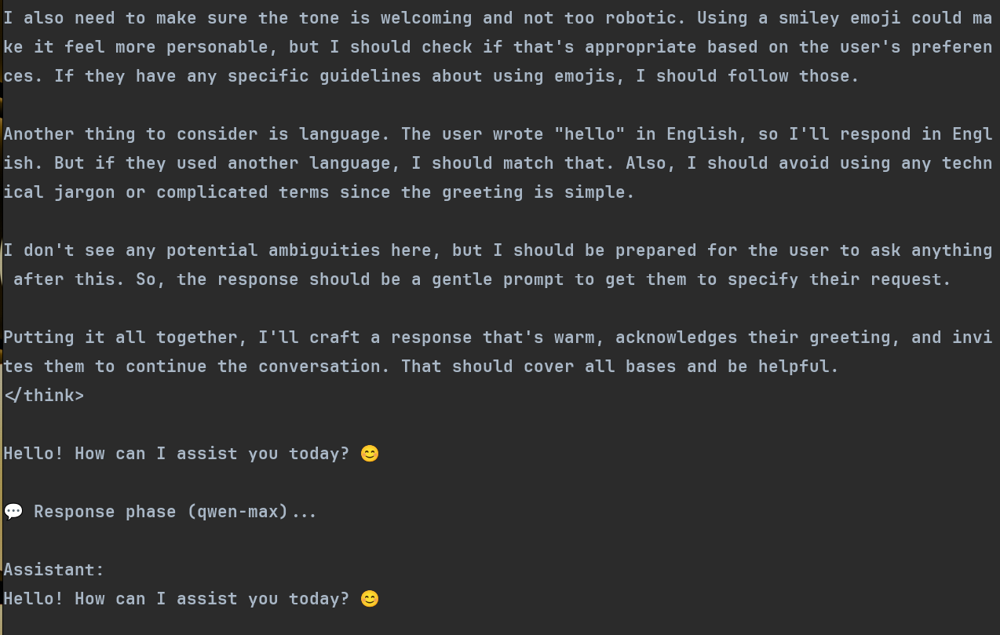

# DualMind

[](https://opensource.org/licenses/MIT)
[](https://github.com/ahrar-deriv/dualmind/actions)

DualMind is a versatile AI assistant designed to assist developers, researchers, and AI enthusiasts in generating high-quality responses for both conversational and coding tasks. It leverages advanced language models to provide thoughtful, context-aware responses through multiple interfaces.

## Features

- **Multi-Interface Support**: Access the AI assistant through:
  - Terminal CLI
  - REST API (OpenAI-compatible)
  - Flutter mobile app
- **Two-Phase Processing**: Uses a reasoning model to think through the problem, then a coding model to generate the final response.
- **Session Management**: Maintains conversation history for contextual responses.
- **Streaming Responses**: Real-time streaming of AI responses.
- **OpenAI-Compatible API**: Works with any client that supports the OpenAI API format.
- **Multiple LLM Provider Support**: Compatible with LiteLLM, OpenRouter, and other OpenAI-compatible APIs.

 <!-- Replace with actual screenshot -->
 <!-- Replace with actual screenshot -->

## Getting Started

### Prerequisites

- Rust (for the backend)
- Flutter (for the mobile app)
- API keys for LLM providers:
  - [LiteLLM](https://litellm.ai)
  - [OpenRouter](https://openrouter.ai)

### Installation

1. Clone the repository:

   ```bash
   git clone https://github.com/ahrar-deriv/dualmind.git
   cd dualmind
   ```

2. Create a `.env` file in the root directory with your configuration:

   ```
   # API Configuration
   API_URL=https://litellm.URL.ai
   # API_URL=https://openrouter.ai/api
   R_API_KEY=your_api_key_here

   # Model Configuration
   REASONING_MODEL=deepseek-r1-distill-llama-70b
   CODING_MODEL=qwen-max
   TEMPERATURE=0.6
   ```

3. Build the Rust backend:

   ```bash
   cargo build --release
   ```

4. Build the Flutter app (optional):

   ```bash
   cd chat_app
   flutter run  # For iOS
   ```

## Usage

### Terminal Interface

Run the assistant in terminal mode:

```bash
cargo run
```

This will start an interactive session where you can chat with the AI assistant.

### API Server

Run the assistant as an API server:

```bash
cargo run -- --api
```

The server will start on port 3000 by default. You can then make requests to the API:

```bash
curl http://localhost:3000/v1/chat/completions \
  -H "Content-Type: application/json" \
  -H "Authorization: Bearer YOUR_API_KEY" \
  -d '{
    "model": "dualmind",
    "messages": [{"role": "user", "content": "Hello world"}],
    "stream": false
  }'
```

### Flutter App

1. Start the API server as described above.
2. Navigate to the `chat_app` directory:

   ```bash
   cd chat_app
   ```

3. Configure the API endpoint in the app settings:
   - Open the app's configuration file (e.g., `lib/config.dart`).
   - Update the `apiUrl` variable to point to your running server (e.g., `http://localhost:3000`).
4. Launch the app:

   ```bash
   flutter run
   ```

## API Reference

The API is compatible with the OpenAI Chat Completions API. Here are the main endpoints:

### POST /v1/chat/completions

Create a chat completion. This is the main endpoint for interacting with the AI.

**Request Body:**

```json
{
  "model": "dualmind",
  "messages": [{ "role": "user", "content": "Hello, how are you?" }],
  "temperature": 0.7,
  "stream": false
}
```

**Parameters:**

- `model`: Always use "dualmind" (required)
- `messages`: Array of message objects with role and content (required)
- `temperature`: Controls randomness (0-1, optional, default: 0.7)
- `stream`: Whether to stream the response (optional, default: false)
- `session_id`: Custom session ID for conversation continuity (optional)

**Response:**

```json
{
  "id": "chatcmpl-123",
  "object": "chat.completion",
  "created": 1677858242,
  "model": "dualmind",
  "choices": [
    {
      "message": {
        "role": "assistant",
        "content": "I'm doing well, thank you for asking! How can I help you today?"
      },
      "finish_reason": "stop",
      "index": 0
    }
  ]
}
```

**Error Response Example:**

```json
{
  "error": {
    "message": "Invalid API key",
    "type": "authentication_error",
    "code": 401
  }
}
```

Common Error Codes:

- `401`: Invalid API key
- `400`: Invalid request format
- `500`: Internal server error

### Session Management

DualMind maintains conversation history for contextual responses. To continue a conversation, include the `session_id` parameter in your API requests:

```json
{
  "model": "dualmind",
  "messages": [{ "role": "user", "content": "What's the capital of France?" }],
  "session_id": "your-session-id"
}
```

## Configuration Options

You can configure the assistant using environment variables or command-line arguments:

```bash
cargo run -- --api_url=https://litellm.ai --api_key=your_api_key_here \
  --reasoning_model=deepseek-r1-distill-llama-70b \
  --coding_model=qwen-max --temperature=0.6
```

Available options:

- `--api_url`: URL of the LLM provider API
- `--api_key`: API key for authentication
- `--reasoning_model`: Model to use for the reasoning phase
- `--coding_model`: Model to use for the coding/response phase
- `--temperature`: Temperature setting for response generation

## Architecture

DualMind uses a two-phase approach:

1. **Reasoning Phase**: The assistant first uses a reasoning model to think through the problem and generate a plan or reasoning.
2. **Execution Phase**: The reasoning is then passed to a coding model that generates the final response.

This approach helps produce more thoughtful and accurate responses, especially for complex queries.

## Performance Considerations

- **Rate Limits**: The API enforces rate limits to prevent abuse. Please refer to your LLM provider's documentation for specific limits.
- **Token Usage**: Each request consumes tokens based on the input and output size. Monitor your token usage to avoid exceeding quotas.

## Contributing

Contributions are welcome! Please follow these guidelines:

1. Fork the repository and create a new branch for your changes.
2. Ensure your code adheres to the project's coding standards.
3. Write unit tests for any new functionality.
4. Submit a pull request with a clear description of your changes.

For bug reports or feature requests, please open an issue in the repository.

## License

This project is licensed under the MIT License - see the [LICENSE](LICENSE) file for details.

## Using Pre-built Executables

If you prefer not to build from source, you can download pre-built executables:

1. Download the appropriate executable for your platform from the [Releases](https://github.com/ahrar-deriv/dualmind/releases) page
2. Create a `.env` file in the same directory as the executable with your configuration:
   ```
   # API Configuration
   API_URL=https://your-llm-provider-url.com/api
   R_API_KEY=your_api_key_here
   
   # Model Configuration
   REASONING_MODEL=your-reasoning-model
   CRAFT_MODEL=your-coding-model
   TEMPERATURE=0.6
   ```